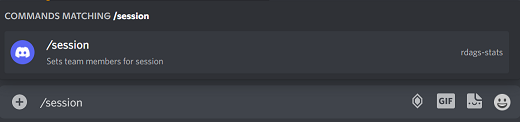
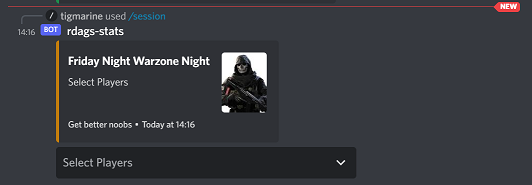
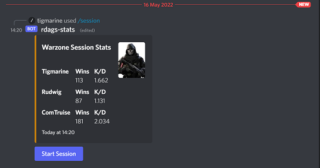
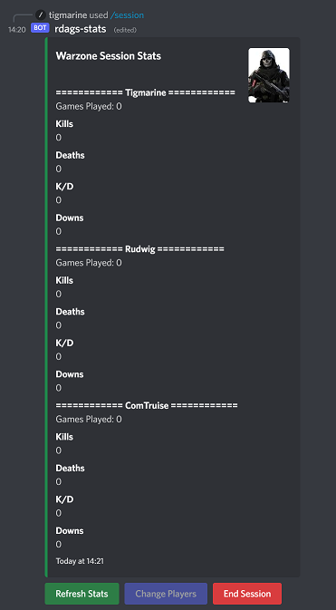
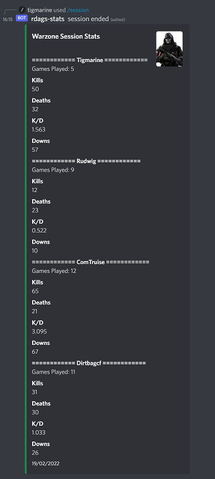

# Friday Night Warzone Stats


## Description

Built in node.js with discord.js and making requests to Call of Duty: Modern Warfare API. This discord bot can provide session stats for Call of Duty Warzone games. Designed to give an overview of performance over the night/session, rather than just stats of a single game or global stats from every game ever played. 

---
## Table of Contents

- [Installation](#installation)
- [Usage](#usage)
- [License](#license)
- [Contributing](#contributing)
- [Tests](#tests)
- [Questions](#questions)

---
## Installation

- Feel free to clone this repo and use it. 
- You will need to subscribe to the Call of Duty API found at [this link](https://rapidapi.com/elreco/api/call-of-duty-modern-warfare/).
- Create a [discord bot](https://discord.com/developers/docs/intro) and link it to a discord server.
- Run npm install.
- Create your own environment variables in a .env file.
- Change the initialArray.js file to represent your player details.
- You will need to register commands to your discord server with the deploy-commands.js file.

    ```bash
    node ./src/deploy-commands.js
    ```


# Usage

- Run the app with the following command.   

    ```bash
    npm start
    ```

- In  your discord server type the following:
    ```bash
    /session
    ```


---
<br>

- User is prompted to choose players from a dropdown menu. 

<br>




---
<br>

- The chosen players overall Kill/Death ratio is then displayed, along with a start session button.

<br>



---
<br>

- When the start session button is clicked the session is initialised and selected players' stats are set to zero. A refresh button is now displayed.

<br>



---  
<br>

- Whenever the refresh button is clicked, session stats are updated.

<br>

<!--  -->

---
<br>

- Click 'End Session' button to end your session and display an overview of session stats.

<br>



---
## License

This project is licensed under 

---
## Contributing

Contributing to this project is welcome as this project is a work in progress.

You can contribute to this project at [GitHub](https://github.com/brett-treweek/friday-night-warzone-stats)

---
## Tests

Please use these commands to perform tests.

```bash

There are no tests at present.

```

---
## Questions

For any questions and support please contact Brett Treweek at bretttrew@gmail.com or message me through [GitHub](https://github.com/brett-treweek).